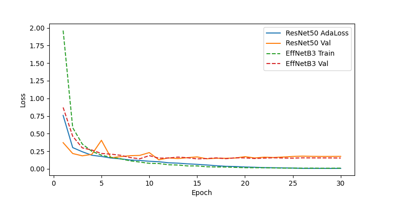
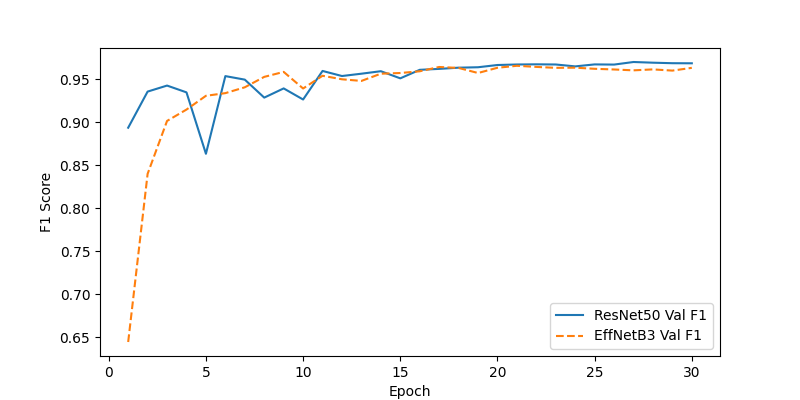

# COVID X-Ray Classification

[](https://github.com/polatbulut/covid-xray-classification/actions/workflows/ci.yml)
[](https://www.python.org/downloads/)
[](https://github.com/astral-sh/ruff)

Classification of chest X-ray images into four categories — **COVID**, **Lung Opacity**,
**Normal** and **Viral Pneumonia** — with PyTorch, using both a from-scratch baseline CNN
and transfer learning from ImageNet backbones.

> **Warning**
> **Not a medical device.** This is a learning project trained on a single public
> dataset. It has not been validated on external data, prospectively evaluated, or
> reviewed by a clinician, and it must not be used to inform any diagnosis or
> treatment decision. See [Limitations](#limitations).

## Contents

- [Installation](#installation)
- [Quickstart](#quickstart)
- [Commands](#commands)
- [Configuration](#configuration)
- [Results](#results)
- [Project structure](#project-structure)
- [Development](#development)
- [Reproducibility](#reproducibility)
- [Limitations](#limitations)

## Installation

Python 3.10 or newer is required.

```bash
python -m venv .venv && source .venv/bin/activate
pip install --upgrade pip
pip install -e ".[dev,data]"
```

On Linux and Windows, `pip` installs a CUDA build of PyTorch by default. For a CPU-only
install, or for a specific CUDA version, follow the
[official selector](https://pytorch.org/get-started/locally/) before installing this
package:

```bash
pip install torch torchvision --index-url https://download.pytorch.org/whl/cpu
```

Verify the runtime that was detected:

```bash
covid-xray check-env
```

## Quickstart

```bash
scripts/download_data.sh
```

```bash
covid-xray split
```

```bash
covid-xray train --config configs/resnet50_augmented.yaml
```

```bash
covid-xray evaluate --config configs/resnet50_augmented.yaml
```

The dataset is the
[COVID-19 Radiography Database](https://www.kaggle.com/datasets/tawsifurrahman/covid19-radiography-database)
(Rahman et al.), roughly 1.2 GB, and requires a Kaggle account and API token.

## Commands

Everything is exposed through a single `covid-xray` entry point. Add `--help` to any
sub-command for its full set of flags.

| Command | Purpose |
| --- | --- |
| `covid-xray split` | Split the raw dataset into `train`/`val`/`test` folders |
| `covid-xray train` | Train a model from a config file |
| `covid-xray evaluate` | Score a checkpoint on the test split and write figures |
| `covid-xray plot-history` | Overlay loss and F1 curves from saved run histories |
| `covid-xray check-env` | Report the detected PyTorch runtime and device |

Symlink instead of copying, avoiding a second copy of the dataset on disk:

```bash
covid-xray split --link
```

Short run for a smoke test, on a specific device, without progress bars:

```bash
covid-xray train --config configs/simple_cnn.yaml --epochs 1 --device cpu --no-progress
```

Compare two completed runs:

```bash
covid-xray plot-history results/history/resnet50_augmented.json results/history/efficientnet_b3.json
```

`train` writes two files: the best checkpoint at `training.checkpoint_path`, and a
per-epoch history JSON alongside it. `evaluate` writes `metrics.json`,
`classification_report.txt`, a confusion matrix and a grid of misclassified examples into
`results/<run name>/`.

## Configuration

Experiments are declared in YAML under [`configs/`](configs). Unknown keys and
out-of-range values are rejected when the file loads, rather than surfacing as a
`KeyError` mid-run.

```yaml
data:
  train_dir: data/processed/train
  val_dir: data/processed/val
  test_dir: data/processed/test
  img_size: [224, 224]          # or a single int
  mean: [0.485, 0.456, 0.406]   # ImageNet statistics
  std: [0.229, 0.224, 0.225]
  augment:                      # every flag is optional and defaults to off
    random_horizontal_flip: true
    random_rotation: 15
    brightness_jitter: 0.2
    contrast_jitter: 0.2

model:
  name: resnet50                # simple | resnet50 | densenet121 | any timm model
  pretrained: true

training:
  epochs: 30
  batch_size: 16
  num_workers: 4
  lr: 0.00005
  weight_decay: 0.0001
  patience: 5                   # early stopping; 0 disables it
  monitor: val_f1               # val_f1 | val_accuracy | val_loss
  class_weighting: inverse      # none | inverse | balanced
  grad_clip: null               # optional gradient-norm clipping
  seed: 42
  checkpoint_path: models/resnet50_augmented.pth
```

Four configurations ship with the project:

| Config | Model | Notes |
| --- | --- | --- |
| [`simple_cnn.yaml`](configs/simple_cnn.yaml) | 3-block CNN | Trained from scratch; a lower bound |
| [`resnet50.yaml`](configs/resnet50.yaml) | ResNet-50 | Transfer learning, no augmentation |
| [`resnet50_augmented.yaml`](configs/resnet50_augmented.yaml) | ResNet-50 | Adds flips, rotation and jitter |
| [`efficientnet_b3.yaml`](configs/efficientnet_b3.yaml) | EfficientNet-B3 | Via `timm`, at 300×300 |

`class_weighting` controls how the imbalanced classes are handled in the loss.
`inverse` (`total / count`) is the default because it is what the recorded runs used;
`balanced` (`total / (n_classes × count)`) matches scikit-learn's convention and differs
from `inverse` by a constant factor of `n_classes`, which behaves like a smaller learning
rate.

## Results

Both 30-epoch runs are recorded in [`results/history/`](results/history) and can be
re-plotted at any time with `covid-xray plot-history`.

| Run | Best validation macro-F1 | Epoch |
| --- | --- | --- |
| ResNet-50 + augmentation | 0.9698 | 27 |
| EfficientNet-B3 | 0.9654 | 21 |




These are **validation** figures, taken at the best epoch. Test-set metrics were not
recorded in this repository; run `covid-xray evaluate` to produce them, along with the
confusion matrix and the grid of misclassified examples.

## Project structure

```
configs/                    Experiment definitions (YAML)
results/history/            Per-epoch metrics for completed runs
scripts/download_data.sh    Kaggle download helper
src/covid_xray/
    cli.py                  `covid-xray` entry point and sub-commands
    config.py               Typed, validated configuration schema
    data.py                 Dataset, transforms and dataloaders
    datasplit.py            Deterministic train/val/test split
    models.py               Baseline CNN and the transfer-learning factory
    training.py             Training loop, class weighting, checkpointing
    early_stopping.py       Patience tracking on the monitored metric
    evaluation.py           Test-set metrics and report
    metrics.py              Macro-averaged accuracy, precision, recall, F1
    checkpoints.py          Checkpoint schema and (de)serialisation
    history.py              Per-epoch history, JSON and CSV
    plotting.py             Confusion matrix, misclassified grid, curves
    runtime.py              Device selection, seeding, mixed precision
tests/                      pytest suite; synthetic fixtures, no dataset needed
```

## Development

```bash
pip install -e ".[dev]"
```

```bash
pre-commit install
```

```bash
ruff check . && ruff format --check . && mypy && pytest
```

Skip the tests that build large backbones:

```bash
pytest -m "not slow"
```

With coverage:

```bash
pytest --cov=covid_xray --cov-report=term-missing
```

The test suite generates its own synthetic images, so it runs in seconds without the
Kaggle dataset and without network access. CI runs lint, type-checking and tests on
Python 3.10, 3.11 and 3.12.

## Reproducibility

- `training.seed` seeds Python, NumPy, PyTorch and every dataloader worker.
- Class discovery and file ordering are sorted, so label indices and sample order do not
  depend on the filesystem.
- The class ordering used at training time is stored **inside the checkpoint** and is
  imposed on the validation and test splits, so labels cannot drift between directories.
- `covid-xray split` is deterministic for a given `--seed`.
- Runs on the same hardware are repeatable; exact bit-level equality across different
  GPUs or cuDNN versions is not guaranteed.

## Limitations

- **Single-source data.** All images come from one assembled dataset. Models trained on
  it are known to latch onto acquisition artefacts and source-specific markers rather
  than pathology, so these scores should not be expected to transfer to images from
  another hospital or device.
- **Validation-only figures.** The numbers above are validation metrics selected at the
  best epoch, which makes them an optimistic estimate.
- **Horizontal flipping.** `resnet50_augmented.yaml` and `efficientnet_b3.yaml` enable
  `random_horizontal_flip`. Mirroring a chest radiograph places the cardiac silhouette on
  the anatomically wrong side. It is kept because it is what the recorded runs used, but
  it is worth ablating.
- **No calibration or uncertainty.** The models emit raw logits, with no calibration and
  no way to abstain on inputs they are unsure about.

## License

No license has been specified. Without one, default copyright applies and others have no
right to use, copy or distribute this code. Add a `LICENSE` file if you intend it to be
reusable.
